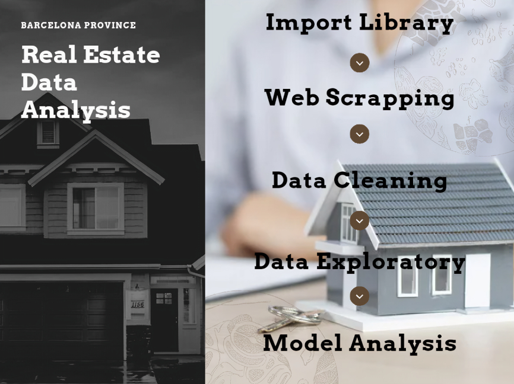
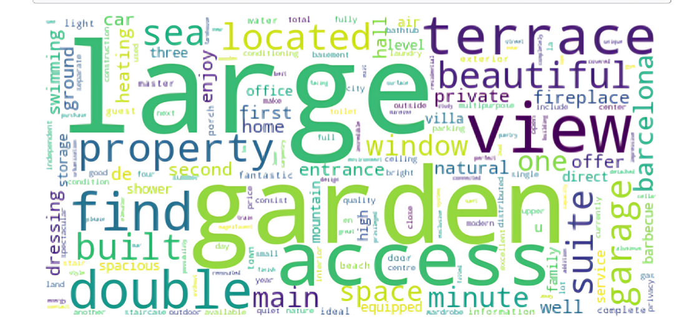

# Real-Estate-Data-Analysis
## Barcelona province housing price prediction. [Click]() here for the full article.

This Project is all about price prediction of houses within Barcelona province.
I felt it would be interesting to gain an insight about the pricing of residential 
house in this marvelous City because of the rate at which individuals from around the globe are settling there.
The Python libraries used include Pandas (for data cleanig and manipulation), BeautifulSoup and request (for Web Scrapping), NLTK (Natural Language Toolkit for text analysis), GEOPY (for locations geocoding analysis), MatPlotlibe(for data visualization), Word Cloud ( for text visualization), sklearn (for model analysis), and other built-in libraries.

In the Jupyter Notebook, you will leearn how I carried out the following steps for the project:

   1. Import Libraries
   2. Web Scrapping
   3. Data Cleaning
   4. Data Exploration
   5. Model Development

## Web Scrapping

The data for this project was scrapped on the 11th of August from [www.thinkspain](), I concentrated on data from houses that has details on Bedroom, Bathroom, Building size and plot of land and skip data on house that doesn't have details for this 4 variables for uniformity sake. All of this data was extracted from the very first web page of various locations within Barcelona province

## Word Cloud
To visualize the most common words in houses advertisement text, I made use of word cloud 

## Model Development

I carried out multiple modeling method which including Random Forests and  Multiple Linear Regression for price prediction
with Bedroom, Bathroom, Building size and plot of land as the Predictor variable, and  Bags-of-words,  TF-IDF for price prediction with advertisement description text as the Predictor variable

 
